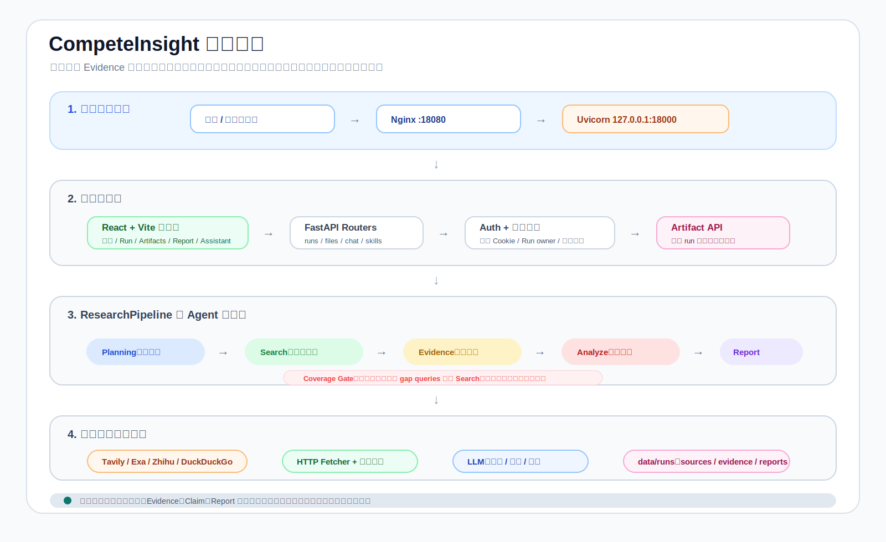
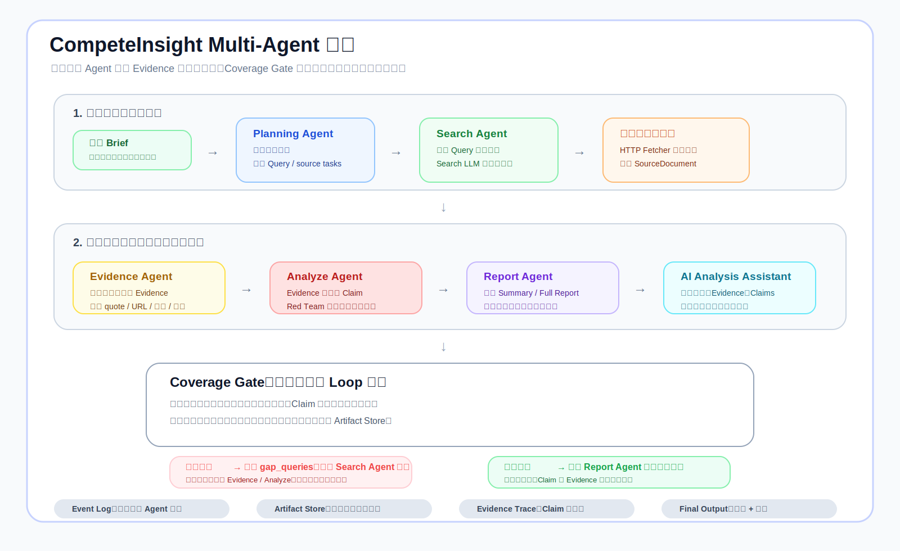

# CompeteInsight

CompeteInsight 是一个证据优先的 AI 竞品分析工作台。它通过多 Agent 研究流水线，把一个粗略的竞品问题转化为公开来源、结构化 Evidence、经过反方审查的 Claim、竞品矩阵、Markdown 报告，以及可以继续追问的 AI Analysis Assistant。

项目面向 CIS AI 驱动竞品分析 Agent 挑战赛构建，目前更偏向公开演示和评审工作台，而不是完整企业级多租户 SaaS。

## 核心能力

- 从目标产品、竞品、研究目标、分析维度和可选种子链接启动一次竞品研究。
- Planning Agent 将问题拆解为研究维度、搜索 Query、source tasks 和质量规则。
- Search Agent 调用 Tavily、Exa、Zhihu、DuckDuckGo fallback 等公开搜索源，执行批量 Query 和定向补洞。
- Fetcher 抓取公开网页正文，并保存可审计 SourceDocument。
- Evidence Agent 从真实正文中抽取结构化 Evidence，保留 URL、quote、竞品、维度、置信度、新鲜度、权威性和相关性。
- Analyze Agent 将 Evidence 聚合为 Claim，并加入 Red Team 风险审查和缺口评估。
- Report Agent 生成 Summary、Full Report、Methodology、竞品矩阵、建议和导出文件。
- AI Analysis Assistant 支持基于本次研究报告、Evidence 和 Claims 继续追问。
- 每次 run 都以本地 artifact 形式保存在 `data/runs`，便于回溯和审计。

## 技术架构



系统采用前后端分离架构：

- 前端是 React + Vite 单页工作台，负责登录、研究启动、Agent Event Log、Artifacts、Report 和 AI Assistant 交互。
- 后端是 FastAPI 服务，负责鉴权、run 管理、文件服务、聊天接口和 Agent 编排。
- ResearchPipeline 串联 Planning、Search、Evidence、Analyze、Report 五个 Agent 节点。
- 外部数据来自 Tavily、Exa、Zhihu 和 DuckDuckGo fallback，正文抽取使用 HTTPX、trafilatura 和 selectolax。
- 数据层采用本地 artifact store，以 JSON、JSONL、Markdown、CSV 等格式保留完整研究产物。

## Multi-Agent 编排



| Agent | 职责 | 关键输出 |
| --- | --- | --- |
| `ResearchPlanningAgent` | 理解用户研究目标，拆分竞品、维度、source tasks 和质量规则。 | `ResearchPlan`、`queries`、`quality_rules` |
| `SourceResearchAgent` | 执行批量 Query，调用多搜索源，并根据缺口进行针对性补充。 | `SourceCandidate`、`SearchMemory` |
| `EvidenceStructuringAgent` | 从真实正文中抽取事实、引用、来源、维度、竞品归属和置信度。 | `Evidence`、Evidence index |
| `AnalysisAndReviewAgent` | 将 Evidence 聚合为 Claim，执行 Red Team 审查，并评估信息缺口。 | `Claim`、`RedTeamNote`、`ResearchFeedback` |
| `ReportComposerAgent` | 生成可阅读竞品报告、执行摘要、方法说明、矩阵和导出文件。 | `Report`、`Matrix`、Recommendations、Battlecards |

流水线里有一个 Coverage Gate：当 Evidence 覆盖不足、来源不够多样、Claim 置信度不足或存在明显反证风险时，系统会生成 gap queries 并回到 Search Agent 定向补洞；当覆盖度满足质量门禁时，才进入最终报告生成。

## 技术栈

- 前端：React 18、TypeScript、Vite、Framer Motion、Lucide icons。
- 后端：FastAPI、Pydantic、Uvicorn、HTTPX。
- LLM：OpenAI-compatible client，支持 Ark、DeepSeek、Qwen 等配置。
- 搜索：Tavily、Exa、Zhihu API、DuckDuckGo fallback。
- 正文抽取：HTTPX、selectolax、trafilatura。
- 存储：本地 JSON、JSONL、Markdown、CSV artifacts。
- 部署：Nginx、systemd、uv、pnpm。

## 项目结构

```text
backend/
  cg/
    agents/          # Agent 实现与运行时辅助逻辑
    api/             # FastAPI routers
    llm/             # OpenAI-compatible LLM client
    orchestrator/    # ResearchPipeline 编排层
    repositories/    # 本地 run / evidence 仓储
    schemas/         # Pydantic 数据模型
    tools/           # 搜索与正文抓取工具
frontend/
  src/
    App.tsx
    styles/global.css
skills/              # Agent workspace 使用的 skill 元数据
scripts/             # 部署与初始化脚本
diagrams/            # README 与提交文档使用的架构图
data/                # 本地 run artifacts，生产部署不会覆盖服务器数据
```

## 本地运行

### 后端

```bash
cd backend
uv sync
uv run uvicorn cg.main:app --reload
```

默认 API 地址是 `http://localhost:8000`。

### 前端

```bash
cd frontend
pnpm install
pnpm dev
```

默认前端地址是 `http://localhost:5173`。

## 环境变量

在 `backend/.env` 中配置至少一个 LLM Provider。

```env
CG_LLM_PROVIDER=ark
CG_LLM_MODEL=your-model-name
ARK_API_KEY=your-ark-key
ARK_BASE_URL=https://ark.cn-beijing.volces.com/api/v3

TAVILY_API_KEY=your-tavily-key
EXA_API_KEY=your-exa-key
ZHIHU_API_KEY=your-zhihu-key

CG_AUTH_USERNAME=your-demo-user
CG_AUTH_PASSWORD=change-me
CG_AUTH_SECRET=replace-with-a-long-random-secret
```

支持的 LLM Key 包括 `ARK_API_KEY`、`DEEPSEEK_API_KEY` 和 `QWEN_API_KEY`。公开仓库中不要提交真实 API Key、评审密码或 `CG_AUTH_SECRET`。

## 登录与用户隔离

当前 demo 使用轻量 cookie-session 登录机制：

- `POST /api/login`
- `POST /api/logout`
- `GET /api/me`

业务 API 和 `/files/...` artifacts 需要登录后访问。新建 run 会标记 owner，便于后续扩展为多用户隔离；服务器上的历史 demo run 可以作为评审样例保留。

## 部署

项目包含一个面向阿里云服务器的部署脚本，会构建前端、打包后端和静态资源，上传到远端，并安装隔离的 systemd + Nginx 服务。

```powershell
powershell -ExecutionPolicy Bypass -File .\scripts\deploy_satmon.ps1
```

当前隔离部署默认值：

- 远端目录：`/mnt/competegraph/app`
- 后端监听：`127.0.0.1:18000`
- 公网入口：`18080`
- systemd 服务：`competegraph-api`

部署脚本不会覆盖远端 `data/runs`，因此服务器上的已有研究 artifacts 会被保留。

## 测试

```bash
cd backend
uv run pytest

cd ../frontend
pnpm build
```

当前状态：

- 后端测试：11 tests passing。
- 前端生产构建：passing。
- 公网健康检查：`/health` 返回 `ok`。

## Demo Run 指标

当前托管 demo 中包含一个 AI coding assistant landscape 的完成样例：

| 指标 | 数值 |
| --- | ---: |
| Source candidates | 282 |
| Sources fetched | 276 |
| Structured evidence | 479 |
| Claims | 50 |
| Verified claims | 33 |
| Challenged claims | 17 |
| Matrix cells | 24 |
| Coverage score | 97.3% |

## 后续路线

- 做 Evidence Graph，可视化 `Source -> Evidence -> Claim -> Recommendation`。
- 增加报告版本管理、diff、采纳和回滚。
- 增加 PM、销售、投资人、战略、Battlecard 等研究模板。
- 用 SSE 或 WebSocket 替代轮询，让 Agent 执行过程更实时。
- 增加浏览器渲染、PDF 解析和更复杂来源处理能力。
- 增加生产级账号体系、HTTPS、审计日志和数据保留策略。

## License

License 尚未最终确定。
